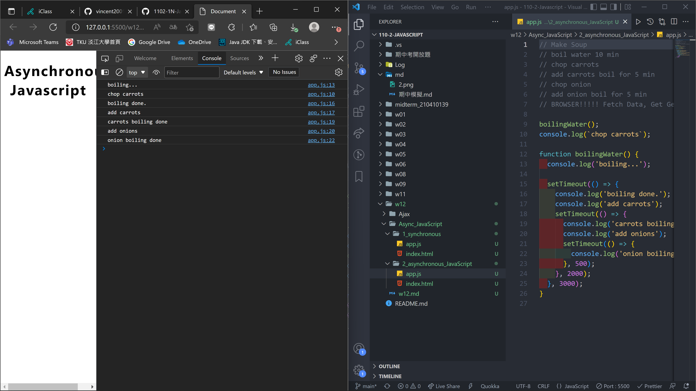
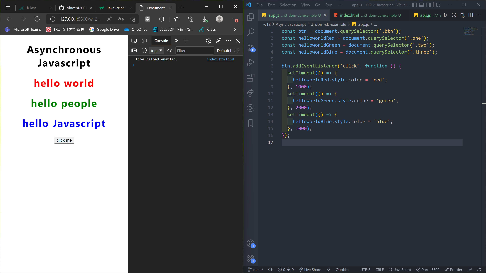
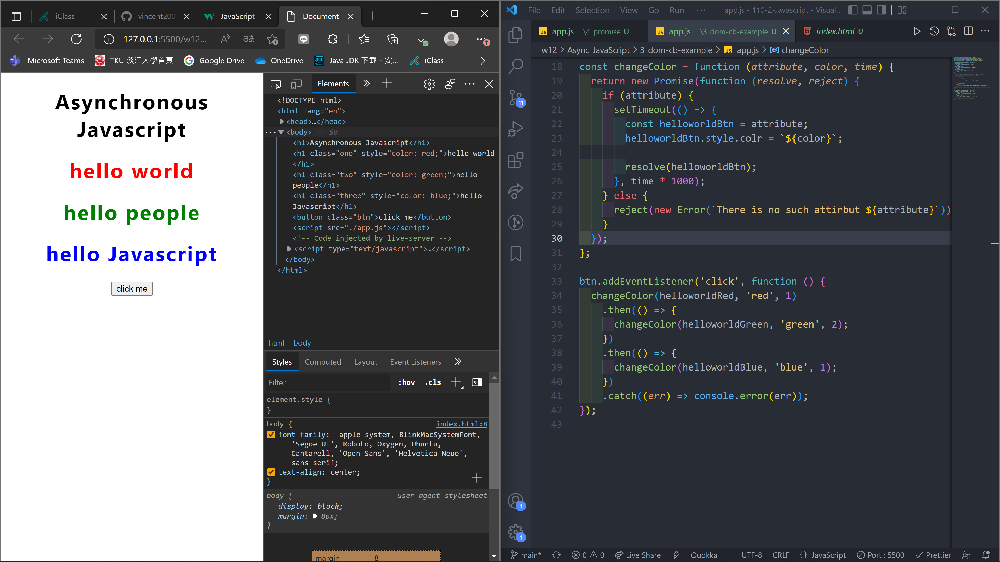
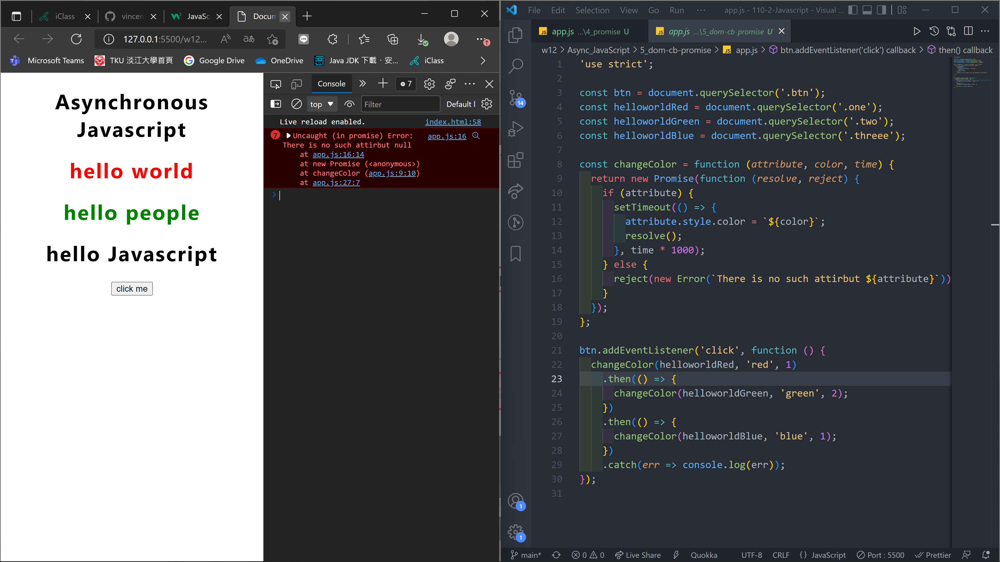
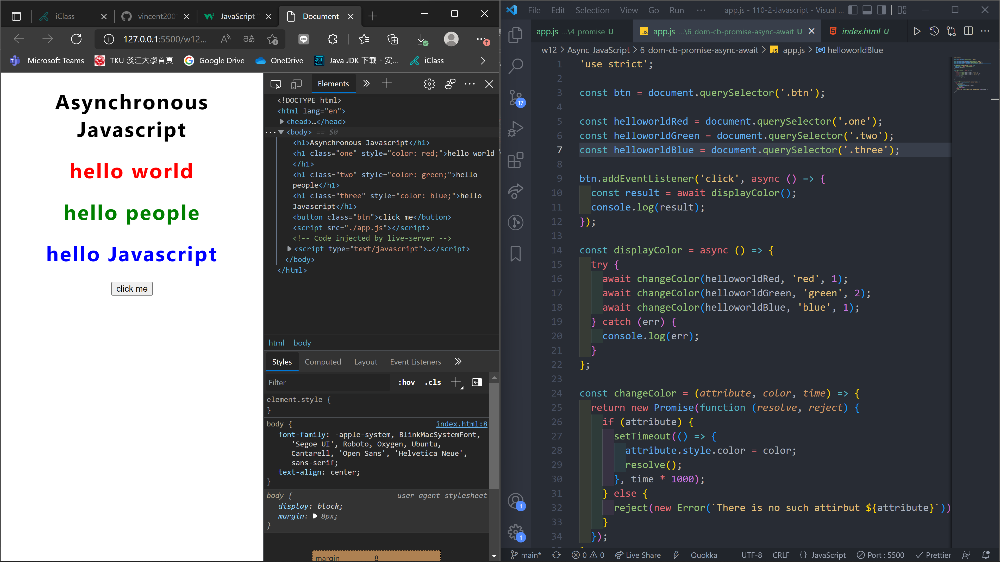
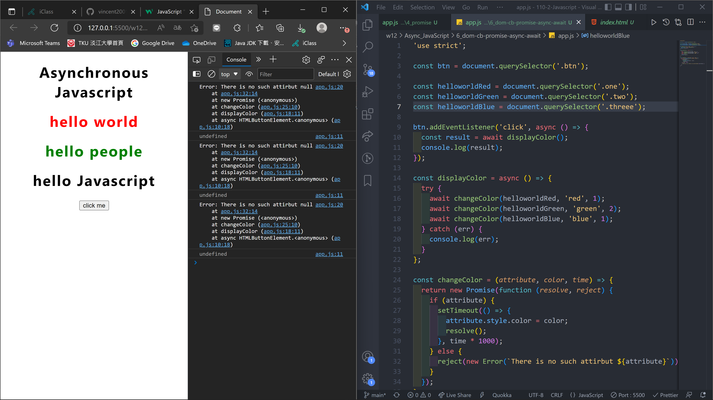
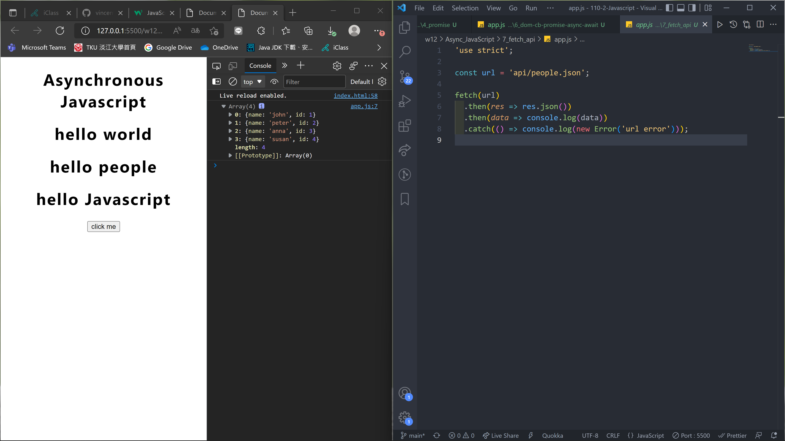
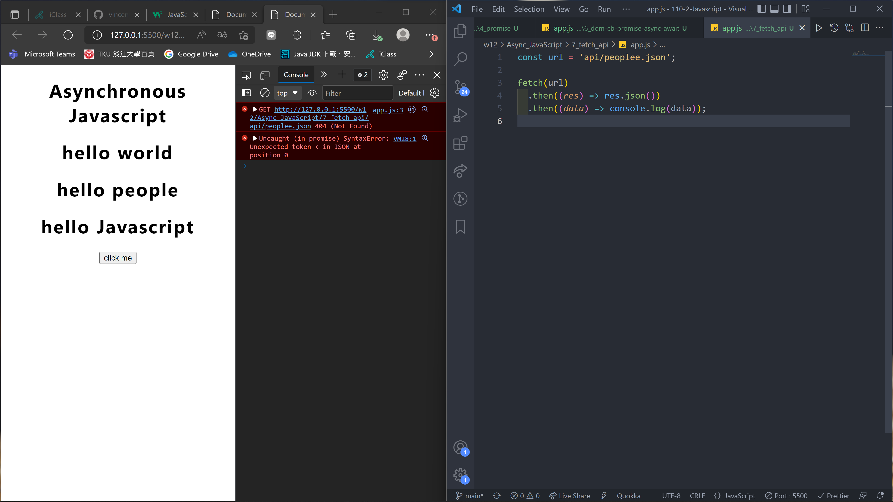

### w12-p1: Making soup demo for Async JavaScript with log info

### w12-p2 DOM call-back function demo -- colors change from red(1s), green (2s), blue(1s)

### w12-p3 use promise addColor(attribute, color, time) to solve-call back hell in w12-p2

### w12-p4 use async / await for w12-p3

### w12-p5 fetch people.json with 4 data shown on console change name to poople.json will result in error

