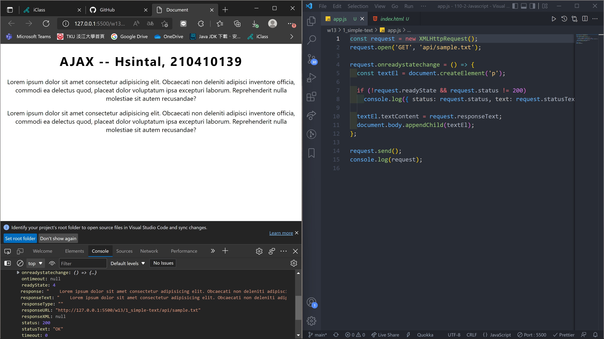
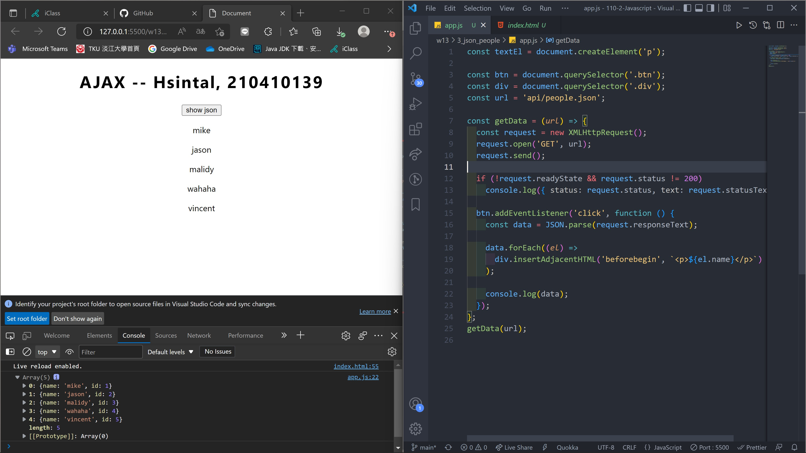
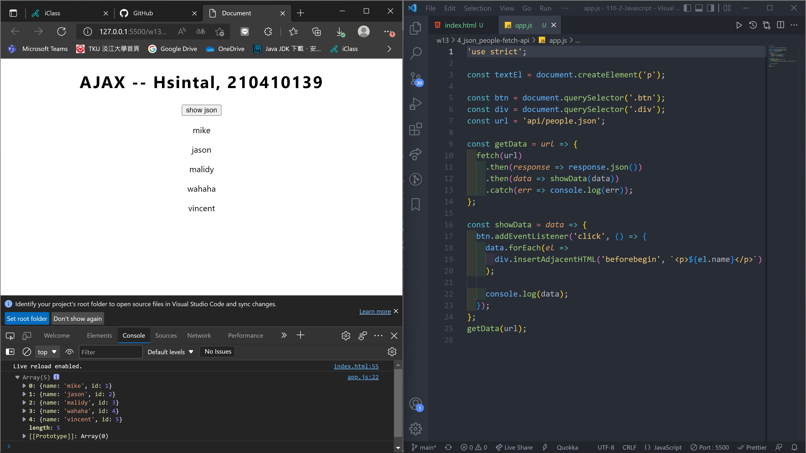
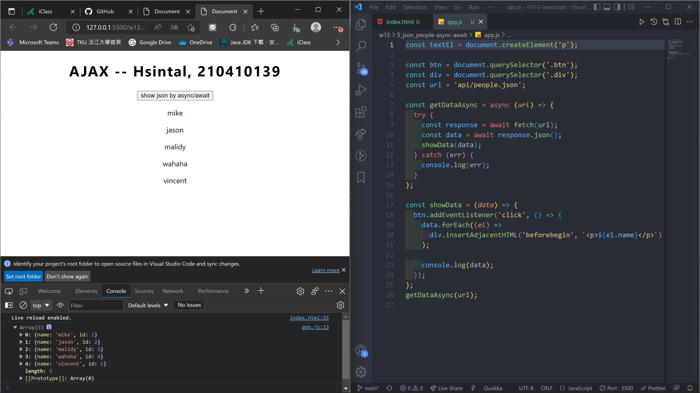
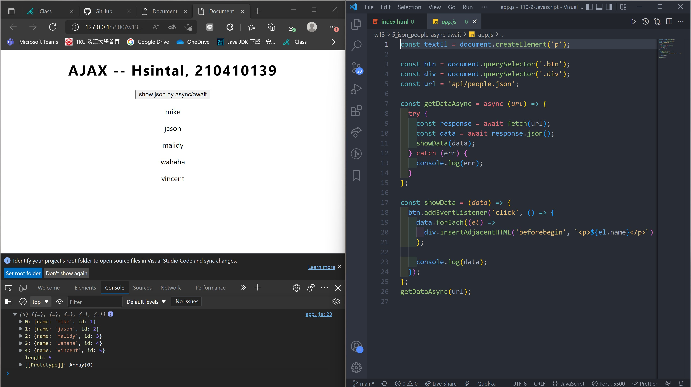

### w13-p1: use xhr object to get sample.txt, and show it on webpage

### w13-p2: use xhr object to get people.json, and show it on webpage

### w13-p3: use fetch api to get people.json, and show it on webpage

### w13-p4: use async/await to get people.json, and show it on webpage

### w13-p5: w1-p5

