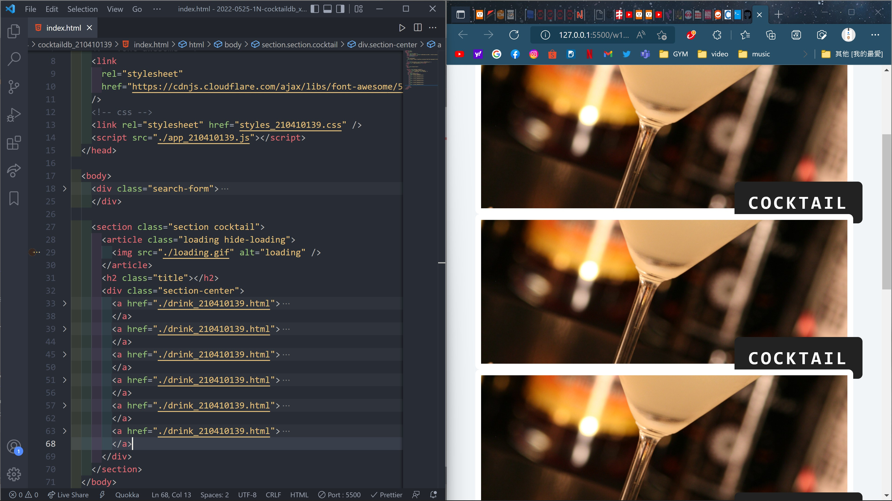
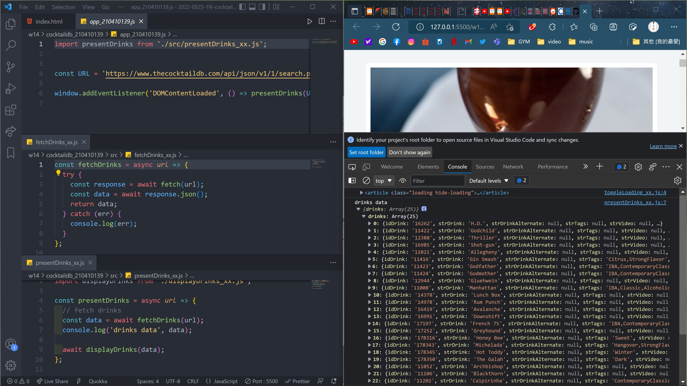
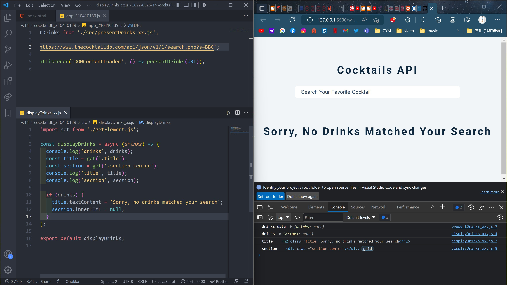
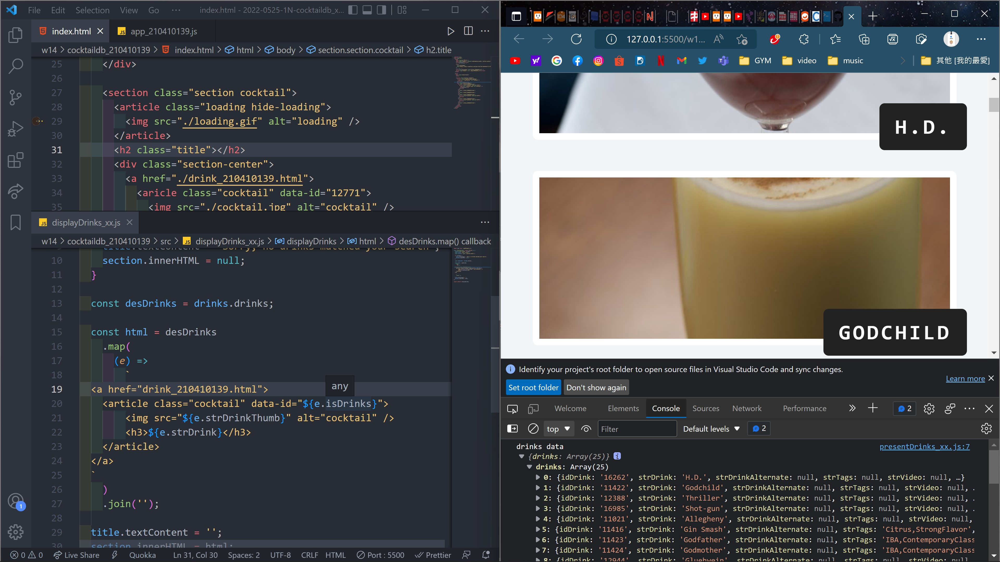
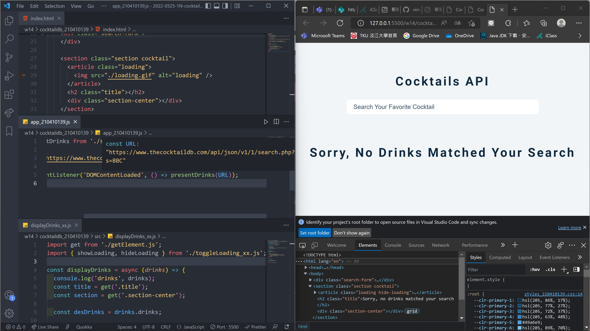
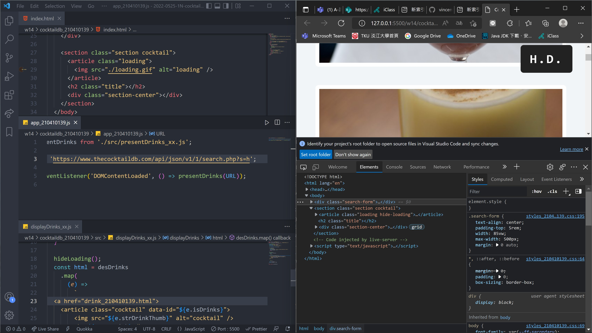

### w14-p1: use create html theme for Cocktail API demo

### w14-p2: fetch data from given url

### w14-p3: fetch drinks, get null, show no drinks matched

### w14-p4: fetch drinks from given url, and display all drinks

### w13-p5-1: let loading.gif show first, remove loading.gif if no drinks matched

### w13-p5-2: let loading.gif show first, remove loading.gif in order to show all drinks

