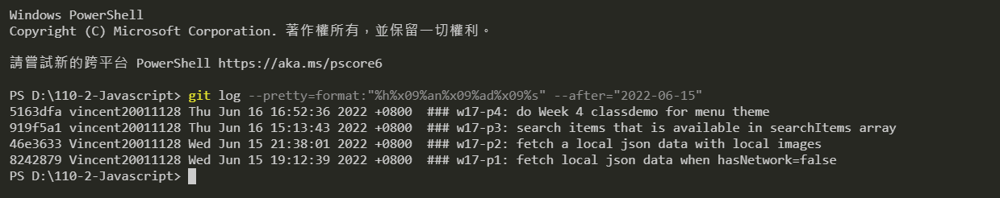

### w17-p1: fetch local json data when hasNetwork=false

### w17-p2: fetch a local json data with local images

### w17-p3: search items that is available in searchItems

### w17-p4: do Week 4 classdemo for menu theme

### w17-last-log

PS D:\110-2-Javascript> git log --pretty=format:"%h%x09%an%x09%ad%x09%s" --after="2022-06-15"
5163dfa vincent20011128 Thu Jun 16 16:52:36 2022 +0800 ### w17-p4: do Week 4 classdemo for menu theme
919f5a1 vincent20011128 Thu Jun 16 15:13:43 2022 +0800 ### w17-p3: search items that is available in searchItems array
46e3633 Vincent20011128 Wed Jun 15 21:38:01 2022 +0800 ### w17-p2: fetch a local json data with local images
8242879 Vincent20011128 Wed Jun 15 19:12:39 2022 +0800 ### w17-p1: fetch local json data when hasNetwork=false
