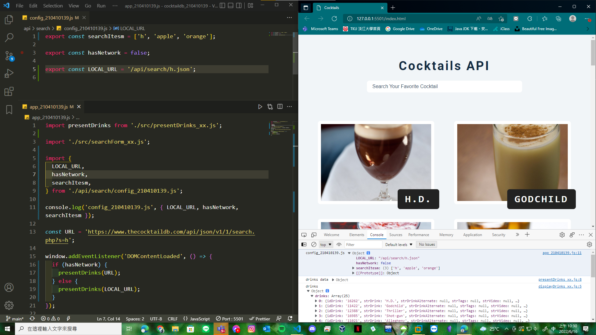
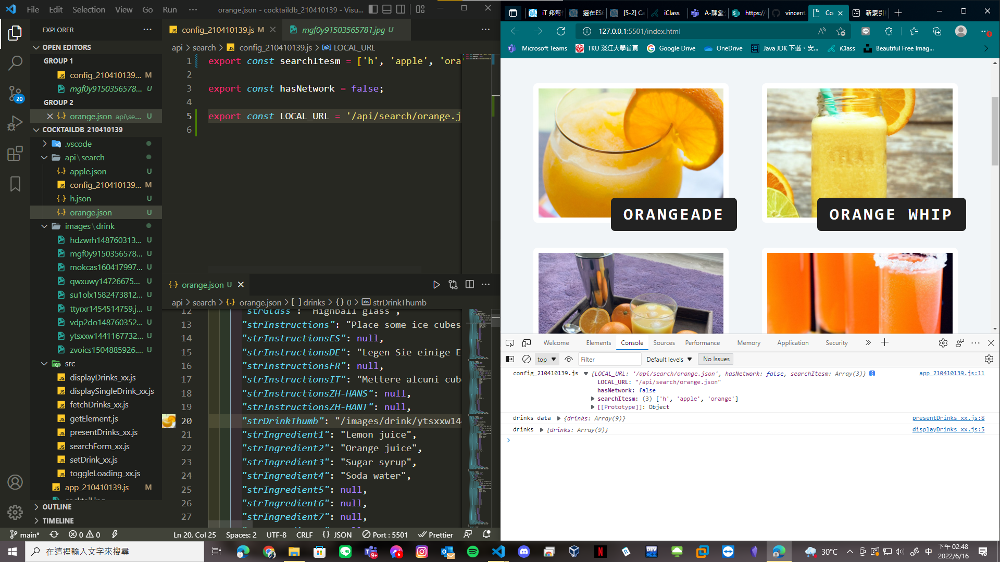
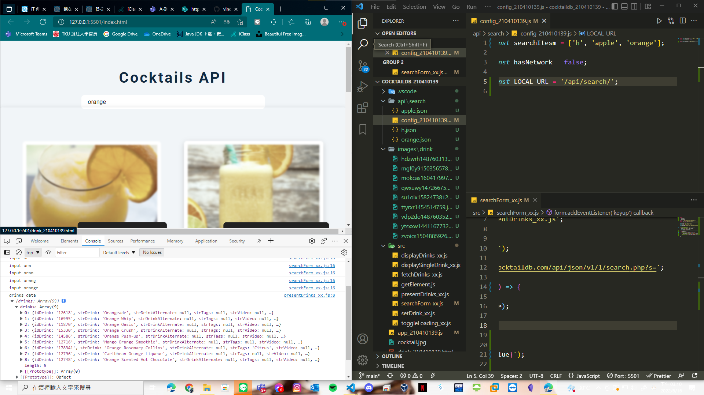
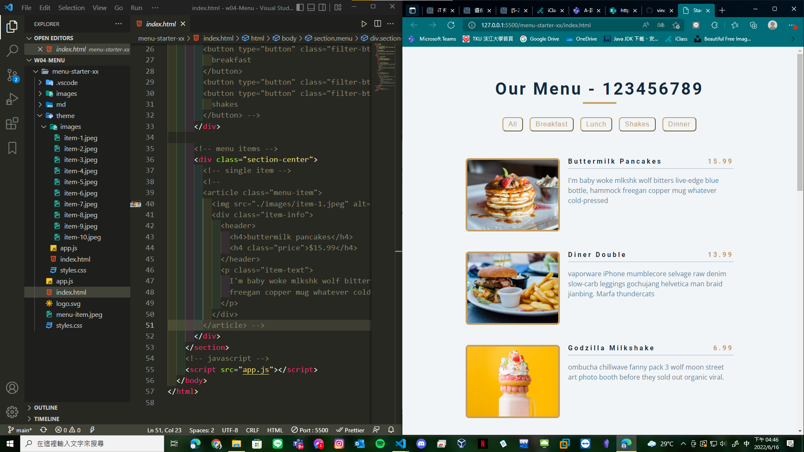

### w17-p1: fetch local json data when hasNetwork=false

### w17-p2: fetch a local json data with local images

### w17-p3: search items that is available in searchItems

### w17-p4: do Week 4 classdemo for menu theme

